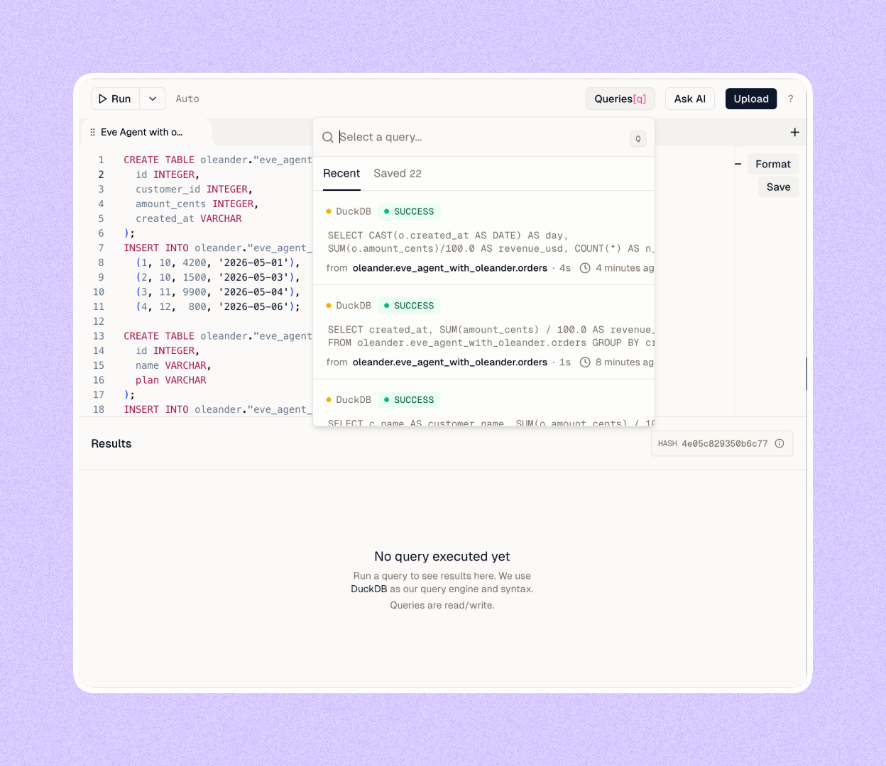

<p align="center">
  
</p>

# Give Your Eve Agent a Multi-Engine Data Warehouse

A minimal template for building an [`eve`](https://vercel.com/eve) agent using [`oleander`](https://oleander.dev/). Give your agent its own multi-engine data warehouse. **Any query. Any size. Always the right engine.**

Below, we follow the [Eve Build an Agent tutorial](https://eve.dev/docs/tutorial/first-agent) so you can get up and running with oleander.

<p align="center">
  <picture>
    <source media="(prefers-color-scheme: dark)" srcset="docs/lake-query-editor-dark.png" />
    
  </picture>
</p>

## Getting Started

Click _Deploy_ to clone this repo and create a Vercel project with an eve agent connected to oleander:

[](https://vercel.com/new/clone?repository-url=https%3A%2F%2Fgithub.com%2FOleanderHQ%2Feve-agent-with-oleander&project-name=eve-agent-with-oleander&repository-name=eve-agent-with-oleander)

When it's done, clone the new GitHub repo and start building locally.

## Try it locally

1. Create an [oleander account](https://oleander.dev/account)

2. Browse to [Vercel's marketplace](https://vercel.com/marketplace/oleander) to connect your oleander oleander.

3. Install dependencies:
```bash
   npm install
```

4. Link Vercel:
```bash
   vercel link
```

5. Connect oleander's warehouse:
```bash
   vercel connect create oleander.dev --name oleander
   vercel connect attach oleander.dev/oleander --yes
```

6. Pull down your environment variables:
```bash
   vercel env pull
```

7. Start the eve agent:
```bash
   npm run dev
```

8. Ask the agent to set up oleander's warehouse with sample data:
```text
   > Seed the oleander warehouse with sample data
```

9. Ask the agent about your sample data:
```text
   > Which customer has spent the most, and how much?
   > Plot total order revenue per customer.
   > For us, an active customer is one with a purchase in the last 30 days. Remember that.
   > How many active customers do we have?
   > Total revenue across all customers, all time, broken out by day.
```

## Learn More

- [Introduction](https://docs.oleander.dev/introduction) — what oleander is and how agents fit in the loop
- [Coding with agents](https://docs.oleander.dev/mcp/introduction) — connect via MCP and CLI
- [Skills](https://github.com/OleanderHQ/skills) — reusable agent skills for lake queries, Spark, and Polars
- [Eve tutorial](https://eve.dev/docs/tutorial/connect-a-warehouse) — warehouse, analysis, glossary, playbooks, spend gate
