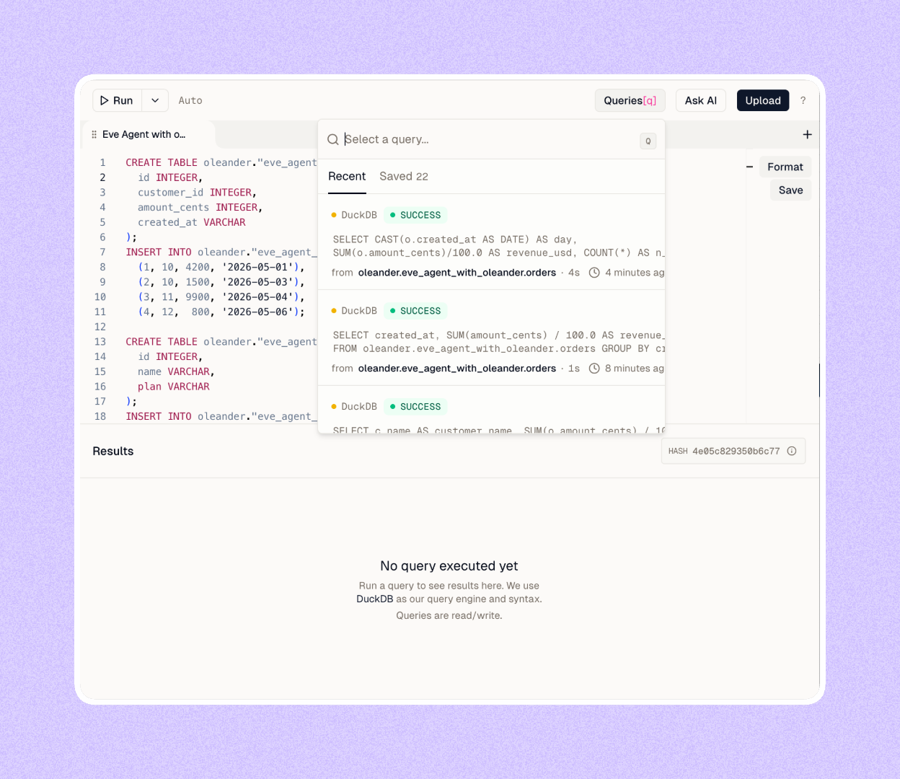

<p align="center">
  
</p>

# Give Your Eve Agent a Multi-Engine Data Warehouse

A minimal template for building an [`eve`](https://vercel.com/eve) agent using [`oleander`](https://oleander.dev/). Give your agent its own multi-engine data warehouse. **Any query. Any size. Always the right engine.**

```text
  YOU                         EVE AGENT                    OLEANDER
┌──────┐                   ┌────────────┐               ┌─────────────────────┐
│ ask  │ ── prompt ──────► │ agent loop │ ── tool ────► │ lake catalog        │
└──────┘                   │ skills     │    call       │                     │
                           └────────────┘               │  multi-engine route │
                                                        │   ┌─ DuckDB         │
                                                        │   ├─ Spark          │
                                                        │   ├─ Polars         │
                                                        │   └─ DataFusion     │
                                                        └─────────────────────┘
```


# What is Eve?

[`eve`](https://vercel.com/eve) is a framework for building typed, deployable AI agents in TypeScript. An eve agent is just a directory, defining instructions and skills in markdown. A minimal agent needs an instructions file and optional runtime configuration:

```text
eve-agent-with-oleander/
├── agent/
│   ├── agent.ts          # chooses the model, configures the runtime
│   ├── instructions.md   # the always-on persona, read every turn
│   └── channels/
│       └── eve.ts        # the built-in HTTP channel, shipped with every app
└── package.json
```

`agent/instructions.md` is the agent's always-on system prompt. `agent/agent.ts` selects the model and configures runtime behavior. Add directories under `agent/` as you need them (for example `tools/`, `skills/`, `channels/`, `connections/`, and `sandbox/`) and eve discovers each capability from its path.

See [Eve project structure](https://eve.dev/docs/project-structure) for the full layout. Below, we follow the [Eve Build an Agent tutorial](https://eve.dev/docs/tutorial/first-agent) so you can get up and running with oleander.

# What Does Your Eve Agent Get with oleander?

* **Universal data access.** Query Iceberg tables, cloud data warehouses, and operational databases through a single MCP server without knowing where the data lives.
* **Intelligent query execution.** Every query is automatically routed to the optimal engine—DuckDB, Spark, Polars, or DataFusion—based on data size, historical performance, and cost.
* **Managed analytics infrastructure.**  Launch a fully managed Iceberg warehouse in minutes, or connect your existing Iceberg catalogs and databases.
* **Trusted, explainable answers.**  Every response includes automatic lineage, execution history, and cost tracking through oleander’s context graph, powered by [OpenLineage](https://openlineage.io/).
* **Cost optimization by default.** Continuously reduce compute costs by running each workload on the most efficient execution engine. No manual tuning required.
* **Built for AI agents.** MCP-native from day one, giving eve a governed, scalable, and production-ready interface to enterprise data.

<p align="center">
  <picture>
    <source media="(prefers-color-scheme: dark)" srcset="docs/lake-query-editor-dark.png" />
    
  </picture>
</p>

## Prerequisites

Before you deploy or run locally, you need an oleander account:

1. Create an [oleander account](https://oleander.dev/account)
2. Browse to [Vercel's marketplace](https://vercel.com/marketplace/oleander) to connect oleander


## Getting Started

Click *Deploy* to clone this repo and create a Vercel project with an eve agent connected to oleander:

[Deploy with Vercel](https://vercel.com/new/clone?repository-url=https%3A%2F%2Fgithub.com%2FOleanderHQ%2Feve-agent-with-oleander&project-name=eve-agent-with-oleander&repository-name=eve-agent-with-oleander)

When it's done, clone the new GitHub repo and start building locally.

## Try it Locally

1. Install dependencies:
```bash
   npm install
```

2. Link Vercel:
```bash
   vercel link
```

3. Connect oleander's warehouse:
```bash
   vercel connect create oleander.dev --name oleander
   vercel connect attach oleander.dev/oleander --yes
```

4. Pull down your environment variables:
```bash
   vercel env pull
```

5. Start the eve agent:
```bash
   npm run dev
```

6. Ask the agent about your data:
```text
   > Load the NYC Taxi dataset into my warehouse.
   > What datasets do I have?
   > Describe the taxi.trips table.
   > Show me the busiest pickup locations.
   > Which neighborhoods generate the most revenue?
   > Rank every taxi zone by revenue over the past five years.
   > Why did you choose that engine?
```


## Learn More

- [Introduction](https://docs.oleander.dev/introduction): what oleander is and how agents fit in the loop
- [Coding with Agents](https://docs.oleander.dev/mcp/introduction): connect via MCP and CLI
- [Skills](https://github.com/OleanderHQ/skills): reusable agent skills for lake queries, Spark, and Polars
- [Eve Tutorial](https://eve.dev/docs/tutorial/first-agent): warehouse, analysis, and more

